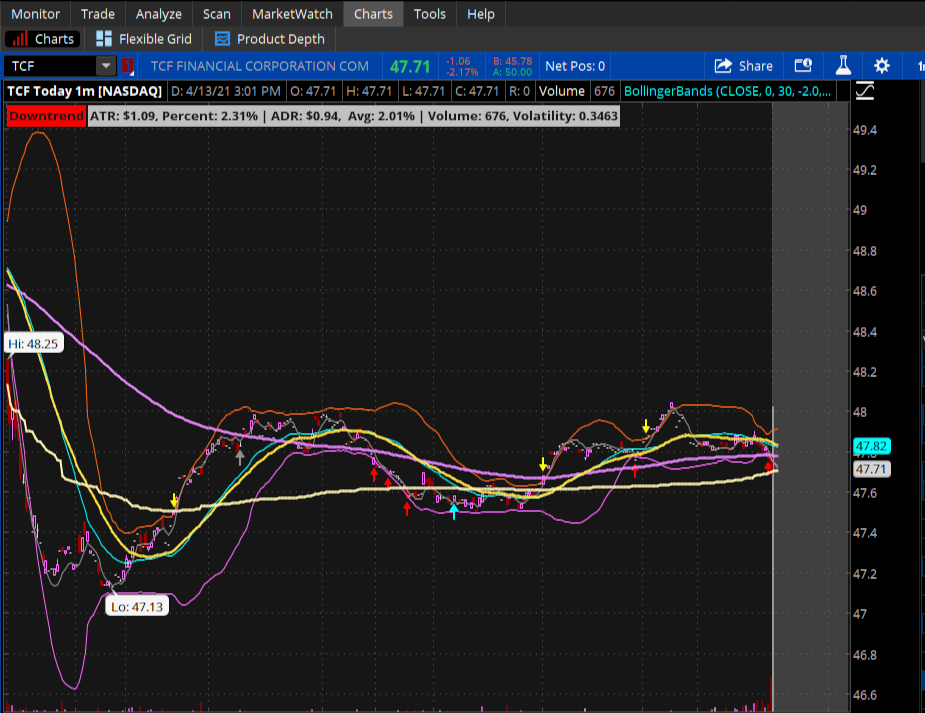
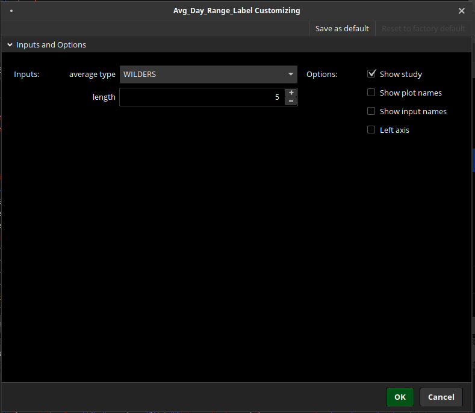

# Average Trade Range Label

**Disclaimer** *In order to demonstrate the functionality of my script, I used actual symbol in the chart image. However, I do not make recommendations or determine the suitability of any security or strategy for individual traders. Any investment decision you make in your self-directed account is solely your responsibility.* 

This script is written for Thinkorswim :registered: platform (TOS). This script will display information about the ticker Average Trade Range, including Daily Price gap, and percent, along with Average Daily Price Range, and percent. I also include with this label the trading Volume and Volatility.  
You can use this code: https://tos.mx/cZuMrVK 

## Use  
You can use this information to help you decide if this stock is a good fit for your trading style.  
Images below show how it would look in the chart.

  
The first label in this image is my [TOS_Trend_Indicator](https://github.com/TechRancher/TOS_Trend_Indicator)  

### Customizing  
This script is very limited on customization. You can change the average type and the length for the Average Daily Range but that is all you can change without editing the code.

  
In the Customizing Window you can see where you can choose different types of Averages along with the length you want the Daily Range to be.  The Average Trade Range (ATR) is set in the script for Day and the user can not change with out changing code.  

#### ThinkorSwim (TOS)  
You can download ThinkorSwim through TD Ameritrade :tm: at: https://www.tdameritrade.com/tools-and-platforms.page
